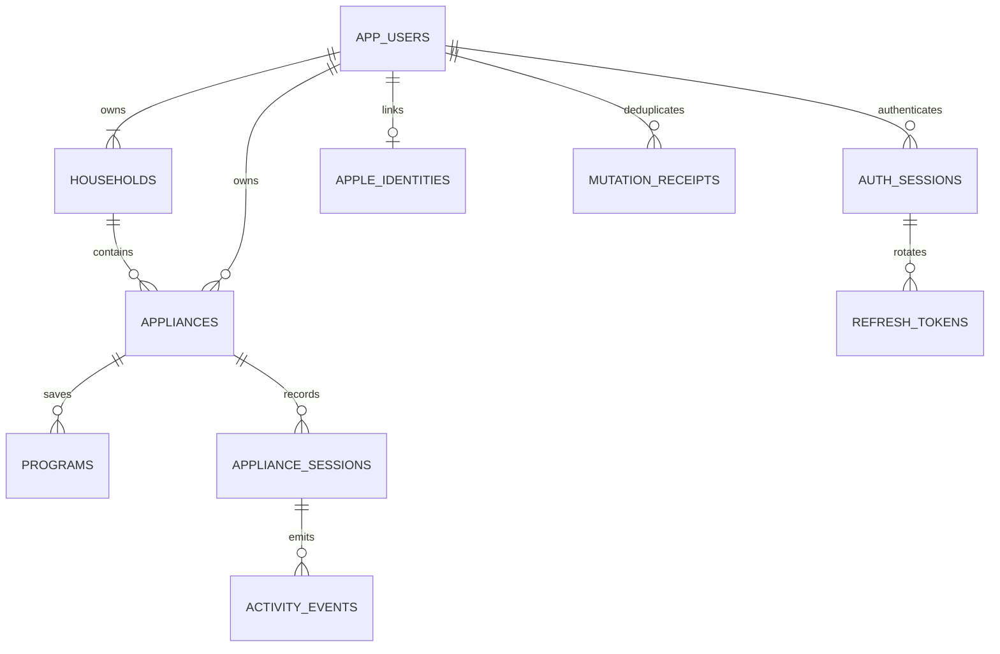

# DONE. backend

Backendul Spring Boot 4.1.1 / Java 21 păstrează conturile, casele, aparatele, programele, sesiunile și activitatea în PostgreSQL. Flyway gestionează schema; Hibernate doar o validează. Contractul include 55 de operații JSON și 8 rute HTML, documentate în [OpenAPI 3.1](docs/openapi.json), importabil în Postman sau un editor OpenAPI.

## Pornire locală

Cu Docker pornit și Java 21 instalat:

```bash
cd /Users/adancau/dev/done-arch/done-api/done-api
./scripts/dev.sh
```

Scriptul creează o singură dată `.env`, cu parolă DB și două chei aleatoare, permisiuni `0600`. Pornește PostgreSQL din Compose, apoi aplicația pe `http://localhost:8080`. Pe macOS selectează automat un JDK 21. La următoarele porniri păstrează `.env` și volumul DB.

Pentru ambele servicii în Docker:

```bash
./scripts/init-env.sh
docker compose up --build
```

Oprire cu `docker compose stop`; volumul `done-postgres` păstrează datele. API-ul și PostgreSQL sunt publicate numai pe localhost în Compose. Health: `GET /actuator/health`, inclusiv verificarea DB. Dockerfile rulează aplicația ca utilizator fără privilegii.

Pentru o bază PostgreSQL existentă, setează `DATABASE_URL` ca URL **JDBC**, `DATABASE_USER`, `DATABASE_PASSWORD`, `JWT_SECRET` base64 de minimum 32 de octeți și pornește `./mvnw spring-boot:run` cu Java 21. Nu activa generarea schemei Hibernate. Flyway rulează migrările la startup; modificările viitoare se adaugă în fișiere noi.

## Crearea bazei și rularea tuturor migrărilor

Pentru PostgreSQL local/existent, creează baza separat de migrări:

```bash
psql -X -h localhost -p 5432 -U done -d postgres -f scripts/create-database.sql
./scripts/migrate.sh
```

Scriptul SQL se rulează cu **psql**, nu ca migrare Flyway. Creează `done`, cu owner `done` și encoding UTF-8, numai dacă baza lipsește. Rolul owner trebuie să existe; utilizatorul conectat trebuie să aibă dreptul `CREATEDB` și să poată atribui ownerul. `psql` cere parola dacă este necesar; poate folosi și `.pgpass`. Pentru alt nume/owner, adaugă `-v db_name=done_test -v db_owner=done_test`. Scriptul nu șterge date, nu schimbă parole și nu modifică ownerul unei baze existente.

Cu PostgreSQL gestionat de Compose, baza și rolul sunt create deja de serviciul `db`:

```bash
./scripts/init-env.sh
docker compose up -d --wait db
./scripts/migrate.sh
```

`migrate.sh` folosește Java 21, Maven Wrapper și aceeași versiune Flyway ca aplicația. Citește `DATABASE_URL`, `DATABASE_USER`, `DATABASE_PASSWORD` din `.env`; variabilele exportate explicit au prioritate. Rulează toate migrările restante din `src/main/resources/db/migration` în ordine, inclusiv cele viitoare, fără să pornească API-ul. La repetare, migrările deja aplicate sunt validate și sărite, folosind același `public.flyway_schema_history` ca Spring Boot. Prima rulare Maven poate necesita acces la internet pentru plugin.

```bash
./scripts/migrate.sh info       # starea și versiunile pending/applied
./scripts/migrate.sh validate   # verifică istoricul și checksumurile
./scripts/migrate.sh --help
```

**Echivalentul lui `USE done`:** în PostgreSQL, baza se alege prin conexiune, aici `DATABASE_URL=jdbc:postgresql://localhost:5432/done`. Toate migrările folosesc această bază și schema `public`; scriptul setează timezone-ul conexiunii la UTC. `USE` este sintaxă MySQL, iar `\connect` este o comandă a clientului psql, incompatibilă cu executarea SQL prin Flyway/JDBC. De aceea V1–V9 rămân nemodificate, cu checksumurile și tipurile `TIMESTAMP` existente păstrate. Nu concatena fișierele pentru execuție manuală: s-ar pierde istoricul Flyway, iar pornirea ulterioară a API-ului ar încerca să creeze din nou schema.

Referințe: [PostgreSQL CREATE DATABASE](https://www.postgresql.org/docs/16/sql-createdatabase.html), [psql și selectarea conexiunii](https://www.postgresql.org/docs/16/app-psql.html), [Flyway Maven](https://documentation.red-gate.com/fd/maven-goal-277579365.html).

## Structură

- `account`: profil, preferințe, schimbarea parolei, ștergerea contului;
- `auth`: email/parolă, JWT, refresh rotit, Apple, rate limiting;
- `household`: casele contului, creare, redenumire și ștergere protejată;
- `appliance`: catalog, aparate, programe și mutarea între case;
- `session`: countdown/cronometru, acțiuni, evenimente și procesare periodică;
- `activity`: activitate paginată și citire;
- `sync`: snapshot, export și statistici;
- `persistence`: entități JPA și repository-uri;
- `common`, `config`: tranzacții, idempotency, validare, erori și securitate.

Entitățile JPA nu sunt expuse prin API. DTO-urile sunt Java records. Toate operațiile sunt limitate la contul autentificat; un UUID care aparține altui cont răspunde `404`. Foreign keys compuse păstrează proprietarul consistent și la nivel SQL.

## Schema

| Migrare | Conținut |
| --- | --- |
| `V1__accounts_and_sessions.sql` | conturi, identități Apple, sesiuni auth, refresh hashes, nonce-uri, aparate, programe, sesiuni, activitate și răspunsuri idempotente |
| `V2__auth_rate_limits.sql` | limite persistente și indici pentru curățare |
| `V3__tenant_integrity.sql` | integritate SQL între proprietar, aparat, program, sesiune și eveniment |
| `V4__preferred_language.sql` | limba preferată a contului |
| `V5__households.sql` | case, migrarea aparatelor existente și integritate casă–proprietar–aparat |
| `V6__appliance_notifications.sql` | preferința de notificări per aparat, pornită implicit |
| `V7__frontend_parity.sql` | custom, Unicode, onboarding, programe/snapshoturi localizate și durate măsurate |
| `V8__sharing_and_auth_methods.sql` | linkuri de status, proiecții locale, metoda autentificării și Apple web |
| `V9__localized_legacy_activity.sql` | traducerea evenimentelor existente și nume Unicode în activitate |



UUID-uri, `TIMESTAMPTZ`, indici pentru istoric și evenimente scadente, chei unice pentru nume și evenimente. Un index parțial permite exact o sesiune deschisă per aparat. Un program șters nu șterge sesiunea: numele și durata ei sunt snapshoturi. Ștergerea aparatului elimină programele, sesiunea activă și istoricul său; ștergerea contului elimină datele aferente, inclusiv tokenurile și răspunsurile cache.

## Autentificare

Emailul este username-ul, normalizat în lowercase. Parolele au 12–64 de caractere și maximum 72 de octeți UTF-8, stocate BCrypt cost 12. Backendul nu trimite emailuri de verificare sau resetare în această etapă.

Access JWT: 15 minute, `iss`, `aud`, `sub` UUID, `sid`, `iat`, `nbf`, `exp`, `jti`, semnătură HS256. Se verifică și sesiunea auth din DB, deci logout, replay de refresh, schimbarea parolei și ștergerea contului invalidează accesul imediat.

Refresh: token aleator de 256 de biți; DB păstrează SHA-256. Tokenul se schimbă la fiecare refresh. Familia expiră după 30 de zile de la login, fără prelungire nelimitată. Reutilizarea unui token consumat revocă familia și întoarce `401`; revocarea este comisă chiar dacă cererea eșuează. Un logout afectează sesiunea curentă; logout-all și schimbarea parolei afectează toate dispozitivele.

Clientul trebuie să serializeze refresh-urile, să salveze noul token înainte de alte cereri și să nu reîncerce automat un refresh consumat după un răspuns pierdut. Fiecare instalare iPhone/iPad are propria sesiune. Watch poate continua să trimită comenzile prin iPhone; nu distribui același refresh token între dispozitive care îl rotesc independent.

Limite persistente: 10 încercări de login per email în cinci minute; 10 înregistrări și 120 de cereri pe celelalte rute auth per IP/rută în cinci minute. Eșecurile sunt contorizate într-o tranzacție separată. Headerul `X-Forwarded-For` nu este folosit implicit. Un reverse proxy trebuie configurat explicit pentru adrese de încredere înainte de activarea forwarding-ului.

## Sign in with Apple nativ

Implicit este dezactivat până la configurarea credențialelor reale. În `.env`:

```dotenv
APPLE_ENABLED=true
APPLE_CLIENT_ID=ro.done.app
APPLE_TEAM_ID=echipa_ta
APPLE_KEY_ID=key_id
APPLE_PRIVATE_KEY_PATH=secrets/AuthKey.p8
```

Adaugă cheia Apple P8 în `secrets/AuthKey.p8` și activează capabilitatea Sign in with Apple pentru App ID-ul `ro.done.app`. Compose montează cheia read-only în `/run/secrets/AuthKey.p8`; fișierul trebuie să fie lizibil pentru UID-ul 10001 al containerului. `APPLE_ENCRYPTION_KEY` este generată separat de cheia JWT; păstreaz-o stabilă și salvată împreună cu configurația, fiind necesară decriptării tokenurilor Apple existente.

Flux:

1. `POST /api/v1/auth/apple/challenge` → `challengeId`, `nonce`, `expiresAt`.
2. Swift setează `ASAuthorizationAppleIDRequest.nonce` la valoarea primită **exact**, deja SHA-256. Cere `.email` și `.fullName`.
3. Trimite `identityToken`, `authorizationCode`, `challengeId` și opțional `displayName` la `POST /api/v1/auth/apple`.
4. Backendul verifică RSA/RS256 prin JWKS Apple, issuer, audiență, expirare, momentul emiterii și nonce. Schimbă codul folosind client secret ES256 și verifică din nou identitatea răspunsului. Challenge-ul este valabil cinci minute și se consumă o singură dată.
5. Primești aceleași access/refresh tokenuri DONE. ca la login cu parolă.

Identitatea este legată de `sub`, nu de emailul trimis de client. Un email Apple verificat care există deja cere login în contul existent și asociere explicită la `POST /me/identities/apple`; conturile nu se unesc automat. Asocierea cere login recent, de maximum cinci minute. Emailul poate fi `null` dacă Apple nu îl mai furnizează.

Refresh tokenul Apple este criptat AES-256-GCM. La ștergerea unui cont Apple, backendul revocă tokenul prin Apple înainte de eliminarea datelor; dacă Apple nu răspunde, contul rămâne pentru reîncercare. Conturile locale cer parola curentă la ștergere; cele Apple-only cer login recent. Tokenurile și cheia P8 nu sunt incluse în export sau logurile aplicației.

Referințe: [verificarea utilizatorului Apple](https://developer.apple.com/documentation/signinwithapple/verifying-a-user), [schimbul tokenurilor](https://developer.apple.com/documentation/signinwithapplerestapi/generate-and-validate-tokens), [revocarea Apple](https://developer.apple.com/documentation/signinwithapplerestapi/revoke-tokens).

## API

Prefix `/api/v1`. Cereri și răspunsuri JSON; `Authorization: Bearer <accessToken>` pentru rutele protejate. Nu trimite Bearer la register/login/refresh/apple/challenge. Autentificarea nu folosește cookies sau sesiuni HTTP.

| Rută | Acțiune |
| --- | --- |
| `GET/POST /households`, `GET/PATCH/DELETE /households/{id}` | casele contului |
| `PATCH /appliances/{id}/household` | mutare în altă casă cu istoric păstrat |
| `PATCH /appliances/{id}/notifications` | notificări pornite/oprite pentru un aparat |
| `POST /auth/register`, `/auth/login`, `/auth/refresh` | cont local și tokenuri |
| `POST /auth/logout`, `/auth/logout-all` | revocare |
| `POST /auth/apple/challenge`, `/auth/apple` | login Apple |
| `GET`, `PATCH`, `DELETE /me` | profil, preferințe parțiale, ștergere |
| `POST /me/password`, `/me/identities/apple` | parolă și asociere Apple |
| `GET /me/export` | export JSON complet |
| `GET /catalog` | șase tipuri și sugestii localizate |
| `GET`, `POST /appliances` | listă și adăugare |
| `GET`, `PATCH`, `DELETE /appliances/{id}` | detalii, redenumire, ștergere |
| `POST /appliances/{id}/programs` | program personalizat |
| `PATCH`, `DELETE /appliances/{id}/programs/{programId}` | editare și ștergere program |
| `POST /appliances/{id}/sessions` | pornire |
| `GET /appliances/{id}/sessions` | istoric paginat |
| `GET /sessions/{id}` | sesiune |
| `POST /sessions/{id}/extend`, `/complete`, `/collect`, `/cancel` | toate acțiunile timerului |
| `GET /activity`, `POST /activity/{id}/read`, `/activity/read-all` | activitate și citire |
| `GET /state` | snapshot pentru sincronizare |
| `GET /statistics?period=week&date=2026-10-05` | săptămână/lună/an |

`Idempotency-Key` UUID este obligatoriu pentru modificările profilului, aparatelor, programelor, sesiunilor și activității. Refoloșește aceeași cheie pentru retry-ul aceleiași cereri. Aceeași cheie cu alte date întoarce `409`. Răspunsurile se păstrează 30 de zile; o reîncercare întoarce răspunsul original, inclusiv timestampul original, deci reîncarcă `/state` pentru starea actuală. După 30 de zile nu reexecuta comenzi offline vechi. Login/refresh/parolă/asociere Apple/ștergere cont au reguli dedicate, fără acest header.

Modificările unui cont se serializează prin lock tranzacțional pe utilizator. Pornirile simultane sunt protejate suplimentar de indexul unic SQL. Redenumirea aparatului și editarea programului cer `version` din ultima citire și resping versiunile vechi. `PATCH /me` schimbă numai câmpurile non-null trimise, ca un toggle să nu suprascrie numele sau timezone-ul.

Erori `application/problem+json`, cu `status`, `detail`, `code`; validarea include lista `errors`. Coduri HTTP: 400 validare, 401 autentificare, 404 resursă absentă/alt cont, 409 conflict, 413 corp peste 64 KiB, 429 rate limit, 503 Apple indisponibil/neconfigurat. Limita corpului este aplicată și pentru transfer chunked.

Paginare: `page` 0–100000, `size` 1–100, implicit 20. Aparatele: maximum 50 per cont; programele: maximum 30 per aparat; countdown inițial: 1–1440 minute. Prelungirile pot duce o sesiune până la maximum șapte zile.

## Sesiuni și activitate

Mașina de rufe, uscătorul și vasele au trei sugestii și programe personalizate. Cuptorul: Încălzire, Coacere, Rumenire. Plita: 5/10/20 minute sau countdown propriu, plus cronometru fără deadline.

Pornire din preset:

```json
{ "programId": "UUID-program" }
```

Durată proprie sau modificarea timpului sugerat pentru această sesiune:

```json
{ "program": { "name": "Rapid", "minutes": 25 }, "saveProgram": true }
```

Valoarea exactă nume/durată/proveniență este reutilizată; altă durată creează un preset distinct fără modificarea celui inițial. Sesiunea păstrează snapshotul ales. `saveProgram: false` păstrează programul doar în sesiune. Cronometru pe orice aparat:

```json
{ "mode": "stopwatch", "program": { "name": "Paste", "minutes": 0 } }
```

La cronometru poți omite `program`, iar numele este cheia localizată `timer.session` („Sesiune”). Nu expiră și nu emite halfway/5 minute/due. Durata se calculează din timestampuri, inclusiv după restart.

Countdown: `running → due → done → collected`. `due` indică depășirea estimării, fără confirmarea aparatului fizic. `complete` este manual; rufe/uscător/vase cer apoi `collect`. Cuptorul, plita și aparatul custom sunt eliberate direct la `complete`. `cancel` păstrează sesiunea oprită în istoric și o exclude din statistici. Acțiunile pe o sesiune veche nu afectează noua sesiune a aparatului.

Milestone-urile sunt persistente: jumătate, 5 minute, depășirea estimării; după confirmarea rufe/uscător/vase, remindere la 30 minute și două ore. La programul de 10 minute, halfway și 5 minute sunt combinate. Programele de cel mult 5 minute omit alerta de 5 minute. Prelungirea mută deadline-ul și următoarea alertă de 5 minute, păstrând halfway-ul original.

Workerul procesează evenimentele scadente la 30 secunde, în loturi de 100, cu aceleași lockuri ca acțiunile HTTP. `next_event_at` și flagurile sunt în DB; după restart recuperează evenimentele fără dubluri. Istoricul activității rămâne disponibil și când notificările de sistem sunt dezactivate. Transportul APNs și actualizările Live Activity prin push nu sunt activate în această etapă; aplicația are deja notificările locale, care vor fi legate la datele serverului la integrarea Swift.

## Contractul Swift

Detalii și exemple în [swift-integration.md](docs/swift-integration.md). UUID-uri și enumuri lowercase compatibile cu modelul nativ. UTC ISO-8601, cu fracțiuni de secundă; decoderul trebuie să accepte timestampuri cu și fără fracțiuni.

`GET /state` folosește o tranzacție PostgreSQL repeatable-read: profil, revision, toate aparatele și sesiunile lor active, ultimele 100 de sesiuni, ultimele 100 de evenimente și numărul necitit. Pentru mai mult istoric folosește endpointurile paginate. Exportul include întregul istoric. Statisticile includ numai sesiunile confirmate și folosesc calendarul din timezone-ul contului, inclusiv tranziții DST; `to` este exclusiv.

Clientul va păstra tokenurile în Keychain, va trata `serverTime` ca reper și va calcula timerul din `startedAt`/`expectedEnd`, nu din polling la secundă. În prima integrare, comenzile noi cer conexiune; afișarea unui timer deja pornit funcționează din snapshot și offline.

## Verificare

```bash
./scripts/test.sh
```

Implicit testele pornesc PostgreSQL 16 prin Testcontainers; Docker trebuie să fie disponibil. Pentru un PostgreSQL de test existent:

```bash
TEST_DATABASE_URL=jdbc:postgresql://localhost:5432/done_test \
TEST_DATABASE_USER=done_test TEST_DATABASE_PASSWORD=parola \
./scripts/test.sh
```

Baza de test este golită între cazuri. Folosește numai o bază dedicată testelor.

Suită: HTTP real pe port aleatoriu, Flyway, JPA și PostgreSQL; toate tipurile de aparat, lifecycle, cronometru, istoric, proprietar, ștergere, optimistic locking, retry-uri și porniri concurente, JWT/refresh/replay, rate limits, asociere/revocare Apple, calendar local, corp chunked și concordanța OpenAPI/rute/DTO-uri. Testele Apple criptografice verifică JWT-uri RSA și client secret ES256 folosind un server JWKS/token/revoke local; nu autentifică un cont Apple real.

Smoke cu JAR-ul executabil, două porniri și persistență:

```bash
./mvnw package
DATABASE_URL=jdbc:postgresql://localhost:5432/done_test \
DATABASE_USER=done_test DATABASE_PASSWORD=parola \
python3 scripts/restart-smoke.py
```

Verificarea din 8 octombrie 2026: Java 21, PostgreSQL 16 prin Testcontainers, **63 de teste trecute**, build Maven verify și imagine Docker construite. Containerul rulează cu profil prod, UID fără privilegii și filesystem read-only; health, paginile, loginul și persistența după restart sunt verificate pe date sintetice. Cele 9 cataloguri publice × 77 texte au validare de chei/placeholders și sintaxă JavaScript. Contractul OpenAPI are 63 operații și 43 scheme DTO, comparate cu controllerele/records. Apple real necesită credențiale și test pe domeniul final; verificările criptografice native/web folosesc un server local simulat.

Pentru publicare: HTTPS, secrete gestionate separat, backup PostgreSQL și configurație de proxy de încredere. `.env` și cheia P8 sunt ignorate de Git/Docker context. Parametrii JWKS/token/revoke Apple rămân endpointurile oficiale în configurația aplicației; în teste sunt înlocuite numai de serverul local.

## Case / households

Fiecare cont nou primește o casă implicită. Flyway V5 creează aceeași casă pentru conturile existente și atașează aparatele fără a schimba ID-urile sau istoricul. Un cont poate avea maximum 20 de case, cu nume distincte de 1–60 de caractere. Aparatele au nume distincte în interiorul unei case; numele se poate repeta în alte case.

La creare aparat, trimite `householdId`; omiterea lui păstrează compatibilitatea cu clienții vechi și folosește casa implicită sau prima casă rămasă. Mutarea cere `householdId` și `version`, păstrează programele, deadline-ul, sesiunile și activitatea. Istoricul și statisticile urmează aparatul în casa destinație.

`GET /appliances`, `GET /activity`, `POST /activity/read-all` și `GET /statistics` acceptă opțional `householdId`. Omiterea păstrează rezultatele pentru întregul cont. `GET /state` și `GET /me/export` includ toate casele și aparatele. Casa activă este o preferință locală a dispozitivului; nu oprește sesiunile din alte case.

O casă poate fi ștearsă numai dacă este goală și contul păstrează cel puțin o casă. Toate mutațiile cer `Idempotency-Key`; redenumirea și mutarea cer versiunea citită. Accesul la o casă a altui cont răspunde `404`, inclusiv în filtrare și mutare; un FK compus previne atașarea între conturi direct în SQL.

`HouseholdView.localizationKey = household.default` identifică numele implicit, pe care clientul îl traduce. Redenumirea elimină cheia și păstrează exact numele utilizatorului. Erorile au coduri stabile pentru traducerea în client. Partajarea și membrii comuni nu sunt introduși în această etapă.

Validare households: `./mvnw verify` pe PostgreSQL a trecut 45 de teste (39 E2E + 6 Apple). Include migrarea V1–V5 cu date existente, CRUD idempotent, izolarea proprietarilor, mutarea cu istoric și sesiune activă, filtrare, citire de activitate per casă și concordanța DTO/rute cu OpenAPI.

## Setările aparatului și notificări

`ApplianceView.notificationsEnabled` reprezintă preferința aparatului, distinctă de `UserView.notificationsEnabled`. La creare poate fi trimisă opțional; omiterea sau null înseamnă true. Flyway V6 setează true pentru toate aparatele existente, păstrând preferința generală a contului.

`PATCH /appliances/{id}/notifications` cere `{ "notificationsEnabled": false, "version": 0 }`, JWT și `Idempotency-Key`. Răspunsul este ApplianceView cu versiunea actualizată. Se aplică izolarea proprietarului, verificarea versiunii și deduplicarea retry-urilor. Redenumirea și mutarea aparatului păstrează preferința.

Un client programează alerte numai dacă preferința contului și cea a aparatului sunt true, iar sistemul a acordat permisiunea. După mute anulează cererile locale ale aparatului; după reactivare programează numai alertele viitoare. Evenimentele de activitate, istoricul, timerul, widgetul și Live Activity continuă. Workerul păstrează activitatea și milestone-urile chiar dacă aparatul este muted; transportul APNs nu este inclus în această etapă.

API-urile existente permit redenumirea și ștergerea oricărui program salvat, inclusiv sugestii. Ștergerea programului nu întrerupe sesiunea activă: snapshotul nume/durată rămâne în istoric, iar programId poate deveni null. Un aparat fără programe poate porni în continuare un countdown custom sau un cronometru de plită.

Compatibilitate: câmpurile opționale noi sunt omise din payloadul intern de idempotency când nu sunt furnizate. Răspunsurile appliance cached înainte de V6 decodează preferința lipsă ca true. Citește GET /state după retry pentru starea curentă. Validare: 48 de teste backend trecute (42 E2E + 6 Apple), inclusiv preferințe independente, sesiuni păstrate, migrare V1–V6 și retry-uri legacy.


## Backend pregătit pentru integrarea ulterioară

Paritatea actuală este documentată în [frontend-parity.md](docs/frontend-parity.md), cu relații, acțiuni, reguli și diagramă de comunicare. Exemple JSON obținute prin HTTP: [contract-examples.json](docs/contract-examples.json). DTO-urile includ programSnapshot/measuredProgram, provenance, onboarding, localizare semantică și cronometru la toate aparatele. Noile comenzi sunt measured-program, repeat și share; statisticile native folosesc `/api/v1/statistics/rolling`.

Partajarea canonicală citește starea din DB și o afișează în browser la `/share/{token}`, cu refresh la 300 secunde. Owner-ul creează/revocă linkul; destinatarul nu primește drepturi de control. Protocolul proiecțiilor clientului local rămâne compatibil, separat și dezactivat implicit în prod.

Pagini publice, în 9 limbi: `/privacy` (alias `/privacy-policy`), `/support`, `/contact`, `/delete-account` (alias `/account-deletion`). Ștergerea web este funcțională prin cont existent și confirmare, cu export opțional; Apple web cere Services ID configurat. Datele de contact mock sunt vizibile ca mock în dev și refuzate în prod. Startup-ul prod cu mockuri a fost verificat să eșueze; backupul PostgreSQL a fost restaurat într-o bază izolată, cu istoricul recuperat.

[Instrucțiuni de deploy](docs/deployment.md): `.env.production.example`, preflight fără expunerea secretelor, Compose separat cu Caddy HTTPS, verificări startup și backup. **Nu s-a făcut deploy public și iOS rămâne local**, conform scope-ului actual. Transportul APNs, resetarea parolei prin email și conectarea iOS sunt etape separate.


Notă de deploy: `TIMESTAMP` în V1 a fost păstrat la cererea proprietarului, după verificare clean cu 63 de teste. Pentru baze cu V1 originală deja aplicată există un checksum diferit; reconcilierea schemei/Flyway a fost amânată explicit. Nu s-a rulat repair. Vezi decizia de la finalul [deployment.md](docs/deployment.md).

## Security hardening and password recovery

See [security.md](docs/security.md) for the explicit route authorization matrix, rate/concurrency limits, SQL injection review, restricted production SQL role, recovery DTOs, SMTP setup, tests and the limits of application-level DDoS protection. The reset flow includes localized `/forgot-password` and `/reset-password` pages. iOS remains local-only. Production now needs separate runtime/migration database passwords and a verified SMTP sender with authenticated TLS; use the updated `.env.production.example` and `scripts/production.sh`. Existing V1–V9 migrations are unchanged; V10 adds recovery storage.
