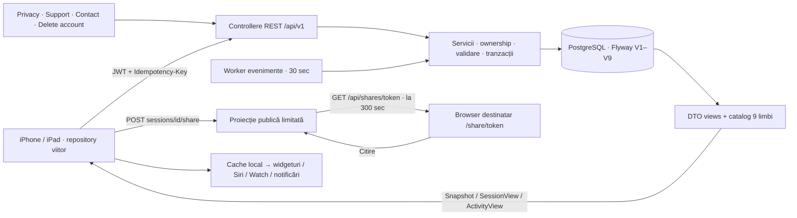

# Paritate backend–iOS: status 8 octombrie 2026

Backendul implementează comportamentele modelului Swift actual. iOS rămâne **frontend-only**, cu stocare locală; nu s-au schimbat autentificarea sau sursa datelor sale. Acest document descrie contractul pentru integrarea ulterioară, nu pretinde că aplicația sincronizează deja conturile.

## Acțiuni și entități

Toate rutele din tabel au prefix `/api/v1`. Contractul exact al DTO-urilor, tipurilor, parametrilor și răspunsurilor este în `openapi.json`; cheile exemplelor JSON sunt în engleză indiferent de limba utilizatorului.

| Model Swift / concept | DTO backend | Relație / acțiuni HTTP |
|---|---|---|
| Profil / onboarding | `UserView`, `UpdateProfile` | `GET/PATCH/DELETE /me`; `onboarded`, `language`, timezone, notificări globale; export și schimbare parolă |
| Casă | `HouseholdView` | User 1 → multe case; `GET/POST /households`, `GET/PATCH/DELETE /households/{id}`; minimum o casă, ștergere numai dacă este goală |
| Aparat | `ApplianceView` | Casă 1 → multe aparate; creare, redenumire, mutare, ștergere, toggle notificări; `washer`, `dryer`, `dishwasher`, `oven`, `hob`, `custom` |
| Program salvat | `ProgramView` | Aparat 1 → multe programe; creare/editare/ștergere; sugestii localizate + programe proprii; aparatul custom începe fără sugestii |
| Programul unei sesiuni | `ProgramSnapshot` | Valoare istorică imuabilă: `name`, `minutes`, `localizationKey`, `isCustom`; nu depinde de existența presetului |
| Sesiune / timer | `SessionView` | Aparat 1 → multe sesiuni, maximum una deschisă; start, +minute, complete, collect, cancel, repeat, salvare program măsurat |
| Activitate | `ActivityView`, `LocalizedMessage` | Sesiune 1 → multe evenimente; listare/citire/read-all; `titleKey`, cheie mesaj + argumente și snapshot preset pentru re-traducere |
| Status partajat | `LiveActivityShareDTO`, `SharedSnapshot` | Sesiune 1 → linkuri (unul activ); proprietarul creează/revocă, destinatarul citește o proiecție limitată, fără cont |
| Sincronizare | `Snapshot` | `GET /state`: profil, case, toate aparatele, sesiuni active, ultimele 100 sesiuni/evenimente, revision și serverTime |
| Istoric complet | `Export`, `PageResponse_SessionView` | `GET /me/export`; `GET /appliances/{id}/sessions?page=0&size=20`; nu trunchia istoricul la snapshotul de sync |
| Statistici native | `FrontendStatistics` | `GET /statistics/rolling?period=week|month|year&householdId=UUID`; 7/30/365 zile, grafic ultimele 7 zile, ultimele 8 sesiuni |

## Reguli care trebuie păstrate la integrare

- Countdown și cronometru funcționează la toate cele șase tipuri. Cronometrul nu are deadline și nu presupune automat că aparatul fizic s-a oprit.
- `due` înseamnă estimare depășită. `done` înseamnă finalizare confirmată manual. Rufe/uscător/vase rămân deschise până la `collect`; cuptor/plita/custom se eliberează direct la `complete`. Sesiunile anulate rămân în istoric și nu intră în statistici.
- Salvarea programului măsurat cere o sesiune stopwatch finalizată, neanulată, cu durată de cel mult 24 ore. Durata presetului este rotunjită în sus la minut, minimum 1. Snapshotul original, durata efectivă și timestampurile rămân neschimbate. Același nume se poate salva o singură dată pentru sesiune. Repetarea folosește programul măsurat dacă există, altfel snapshotul original.
- Un preset selectat poate avea `minutes` suprascrise la start. Valori diferite reprezintă programe distincte; nu se rescrie presetul inițial. Un preset șters nu distruge istoricul și nu este recreat prin retry al salvării măsurate.
- Limitele numelor sunt caractere vizibile Unicode, normalizate NFC: aparat/profil 40, program/casă 60. Numele custom rămân literale, inclusiv dacă au `{0}`. Nu traduce conținutul utilizatorului.
- Limbi: `en`, `ro`, `es`, `it`, `fr`, `de`, `pl`, `hi`, `ja`. `GET /localizations/{language}` este public. DTO-urile păstrează cheile pentru traducerea în limba preferată curentă; răspunsurile de activitate au și titlul/mesajul rezolvat. Migrarea V9 completează metadatele evenimentelor vechi.
- Notificările sunt pornite implicit per aparat; preferința globală și permisiunea sistemului determină transportul. Mute nu oprește timerul, istoricul, widgetul sau activitatea. Backendul produce evenimente persistente; **APNs și Live Activity push nu sunt transporturi implementate aici**. Widgeturile, Siri și Watch continuă să țină de clientul nativ.
- Casa activă este preferință locală. Mutarea aparatului păstrează sesiunea/istoricul și mută statisticile în casa destinație. Partajarea unei sesiuni nu acordă acces la casă sau drepturi de control altui cont.
- Fiecare mutație de domeniu cere `Idempotency-Key` UUID. Retry folosește aceeași cheie și aceleași date. Răspunsul replay este cel original: recitește `/state` pentru actualitate. `version` protejează modificările concurente. Auth, schimbare parolă, legare Apple și ștergere cont au fluxuri dedicate fără acest header.

## DTO-uri JSON și comunicare

Exemple complete, obținute prin HTTP dintr-un backend pornit, sunt în `contract-examples.json`. OpenAPI include toate DTO-urile, inclusiv body-urile comenzilor. Exemplu start din preset cu durată modificată:

```json
{"programId":"b7c3b104-532b-4d5f-aec3-8b709f24d07a","minutes":45,"saveProgram":true}
```

Start fără estimare, pentru orice aparat:

```json
{"timingMode":"stopwatch"}
```

`timingMode` este aliasul acceptat pentru `mode` în body-ul de start; `SessionView` returnează ambele pentru compatibilitate. Metadata programului măsurat apare separat:

```json
{"measuredProgram":{"name":"Programul meu","minutes":82,"localizationKey":null,"isCustom":true}}
```



## Partajare: două protocoale, aceeași pagină

1. **Cont sincronizat (preferat):** `POST /sessions/{id}/share` autentificat, key UUID → link. GET public citește starea curentă din DB, inclusiv redenumire, limbă, +minute, finalizare și collect. `GET /session-shares` listează linkurile curente ale contului. `DELETE /session-shares/{token}` cu JWT+key le revocă. Linkurile expiră după 7 zile și dispar când este șters aparatul/contul.
2. **Client local actual (compatibilitate):** rutele fără `/v1`, `POST/PUT/DELETE /api/shares`, folosesc proiecție + write capability privată și revision. GET public citește ultima proiecție publicată; telefonul trebuie să o actualizeze când poate rula. Acest mod este dezactivat implicit în profilul prod; activarea este opțională și nu autentifică un cont. Tokenul privat nu intră în URL sau DTO public.

Pagina browser reîncarcă la 5 minute, la revenirea în prim-plan și manual. Timerul se calculează local din timestampuri. Refresh la 5 minute nu promite că un telefon cu aplicația închisă publică automat la 5 minute; modul canonical DB elimină această dependență după integrarea iOS.

## În afara integrării actuale

Nu s-a făcut migrarea datelor locale Swift în conturi, nu s-au implementat membership/invitații de household și nu s-a activat transportul APNs. Nu există resetare parolă prin email sau verificare email. Operațiile implementate au teste HTTP reale, izolare între conturi și persistență DB; aceste limitări trebuie păstrate explicite în planul de lansare.
